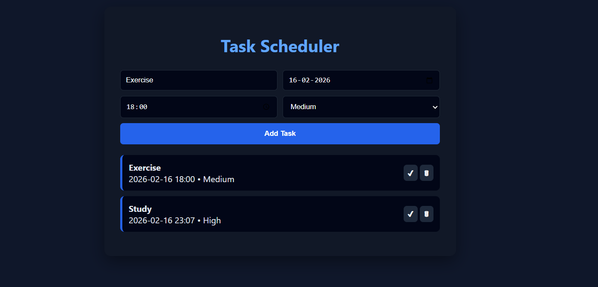
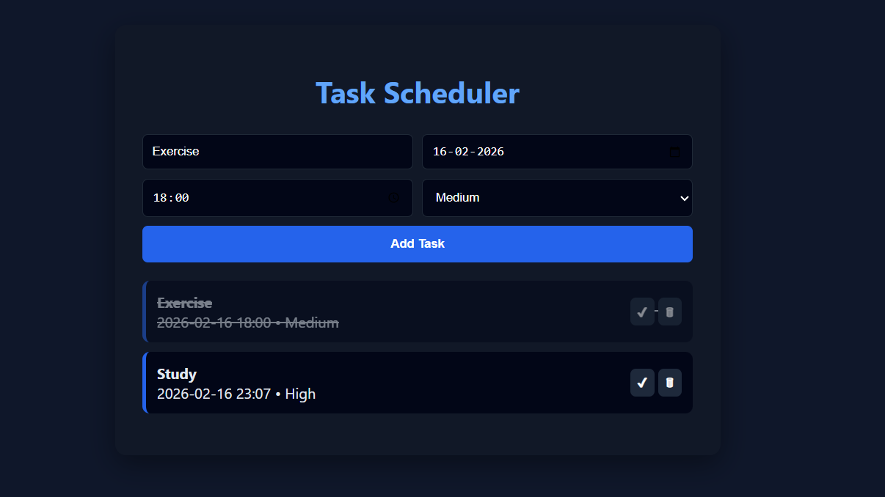

# Task Scheduler

A modern web-based task scheduler for organizing tasks, managing priorities, and improving productivity.

---

## Live Features

* Add tasks with title, date, and time
* Set priority levels (Low / Medium / High)
* Mark tasks as completed
* Delete tasks
* Clean dark-theme UI
* Responsive layout

---

## Tech Stack

* HTML5
* CSS3
* JavaScript (Vanilla JS)

---

## Application Preview

### Empty Scheduler


### Tasks Added



### Task Completed



---

## Project Structure

```
Task-Scheduler/
│
├── index.html
├── style.css
├── script.js
└── screenshots/
```

---

## How to Run

Clone the repository:

```
git clone https://github.com/lithika-1234/Task-Scheduler.git
```

Open:

```
index.html
```

in your browser.

---

## Future Improvements

* Local storage support
* Task reminders
* Drag-and-drop task sorting
* Dark/light theme toggle
* Mobile-first UI improvements

---

## Author

Lithika Jayaprakash
Computer Science Student

